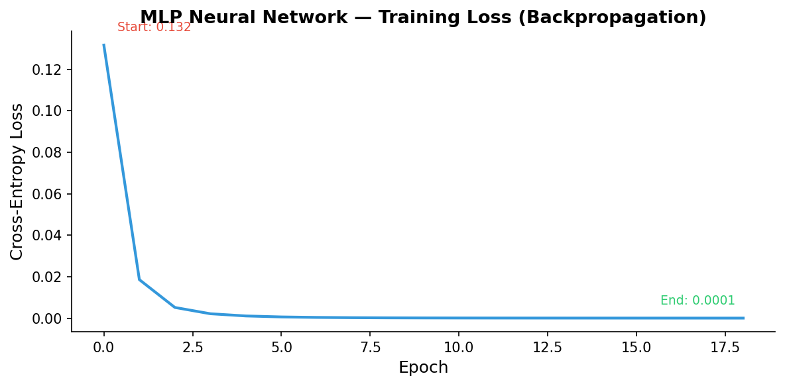
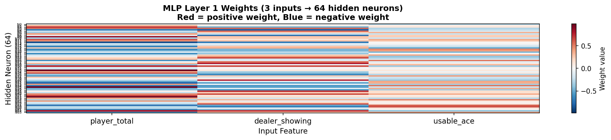
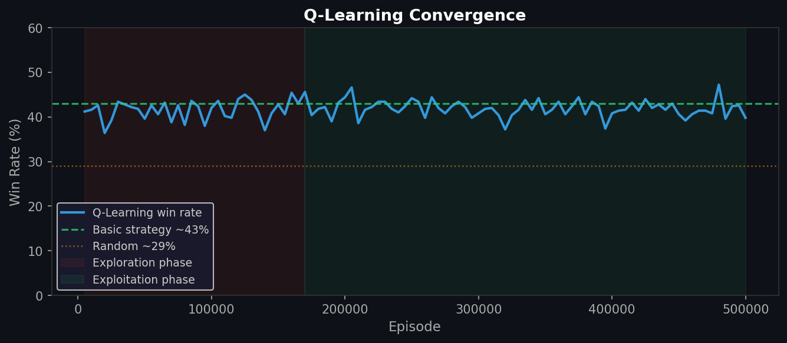
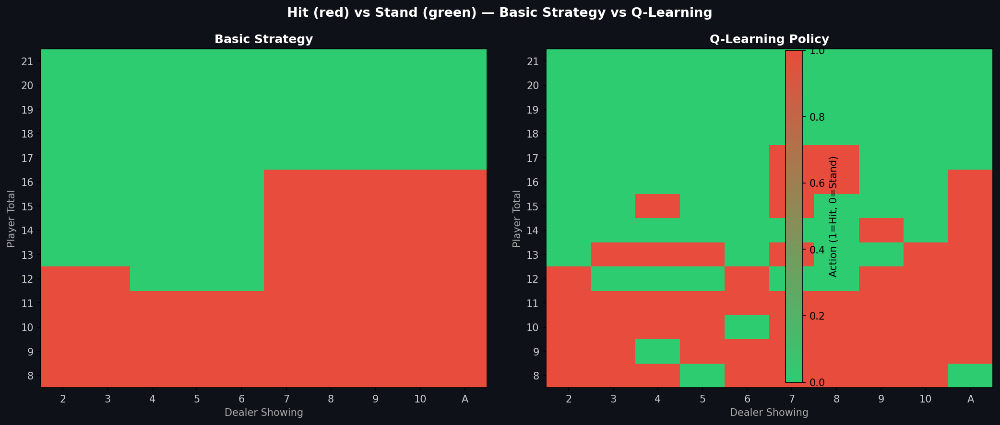
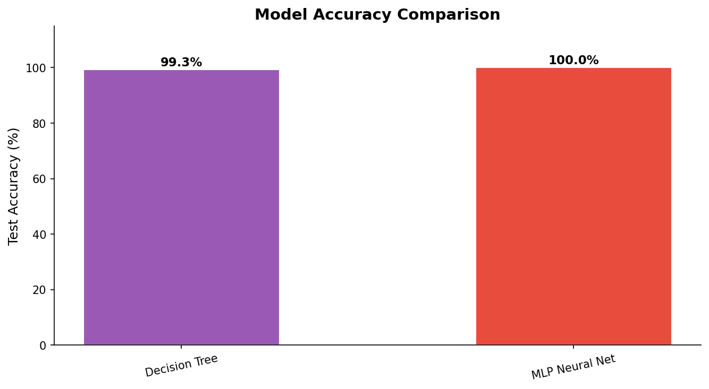

# UNIVERSITY OF BAKIRCAY

## FACULTY OF ECONOMICS AND ADMINISTRATIVE SCIENCES

## MANAGEMENT INFORMATION SYSTEMS

### MIS 336 – APPLIED ARTIFICIAL INTELLIGENCE

### FINAL PROJECT REPORT

---

# Blackjack Strategy Learning Using Machine Learning and Reinforcement Learning

**ASSOC. PROF. EMINE UCAR**

**18 MAY 2026**

**Project Member:**
Can Batu

---

## Contents

- [A. Introduction](#a-introduction)
- [B. Dataset Description and Variables](#b-dataset-description-and-variables)
- [C. Data Preprocessing and Feature Engineering](#c-data-preprocessing-and-feature-engineering)
- [D. Material / Method](#d-material--method)
- [E. Results and Interpretation of Success](#e-results-and-interpretation-of-success)
- [F. Conclusion](#f-conclusion)

---

## A. Introduction

Blackjack is one of the few casino card games in which a player's decisions meaningfully influence the outcome. Unlike purely luck-based games, Blackjack involves a sequence of binary choices — **hit** (draw another card) or **stand** (stop drawing) — made under partial information. Mathematically optimal play, known as **basic strategy**, reduces the house edge to approximately 0.5%, making it the closest a player can come to breaking even against a casino without card counting.

This project develops a complete AI system that learns the optimal Blackjack decision policy through multiple approaches. We simulate 300,000 games across three strategy types, construct a clean labeled dataset of all valid game states, and train two supervised classifiers — **Decision Tree** and a **Multi-Layer Perceptron (MLP) Neural Network** — to reproduce the mathematically proven optimal strategy. In addition, a **Q-Learning** reinforcement learning agent is trained from game rewards alone, without labeled data. All models are deployed in an interactive **Streamlit web dashboard** with real-time recommendations and plain-language explanations.

Our approach covers the full machine learning pipeline: game simulation and dataset generation, feature engineering and label extraction, model training with hyperparameter analysis, backpropagation-based neural network training, reinforcement learning with epsilon-greedy exploration, evaluation with standard classification metrics, simulation-based validation, and deployment as a live web application.

### A.1 Blackjack Rules Summary

- Player and dealer each receive two cards. The dealer's second card is hidden.
- Card values: number cards = face value; J/Q/K = 10; Ace = 11 or 1 (whichever avoids bust).
- Player decides: **hit** (draw a card) or **stand** (stop). Player busts if total exceeds 21.
- Dealer must hit until reaching 17 or above.
- Higher total without busting wins. Ties are draws. "Blackjack" (Ace + 10-value on deal) pays 1.5×.

---

## B. Dataset Description and Variables

### B.1 Simulation Dataset

To understand strategy performance and generate win-rate benchmarks, we simulated **300,000 Blackjack hands** — 100,000 per strategy — using a custom 6-deck shoe implemented in `game_engine.py`. The core simulation loop is shown below:

```python
# simulate.py — core simulation loop
def simulate(num_games, strategy_fn, strategy_name):
    deck = Deck(num_decks=6)
    results = []
    for i in range(num_games):
        game = BlackjackGame(deck)
        result = game.play_one_hand(strategy_fn)
        result["episode_id"] = i + 1
        result["strategy"] = strategy_name
        results.append(result)
    return results

# Run all three strategies
r1 = simulate(100_000, random_strategy,  "random")
r2 = simulate(100_000, naive_strategy,   "naive")
r3 = simulate(100_000, basic_strategy,   "basic")
```

Three strategies were simulated:

| Strategy | Description | Win Rate |
|----------|-------------|----------|
| **Random** | Randomly chooses hit or stand with equal probability | ~29% |
| **Naive** | Hits if total < 17, stands otherwise | ~39% |
| **Basic** | Mathematically optimal strategy from Blackjack literature | ~43% |

Each simulated game record contains the following columns:

| Column | Type | Description |
|--------|------|-------------|
| `episode_id` | int | Game sequence number within each strategy run |
| `strategy` | str | Which strategy played this hand |
| `player_total` | int | Player's **final** hand value after all actions |
| `dealer_total` | int | Dealer's final hand value |
| `dealer_showing` | int | Dealer's visible (upcard) value at game start (2–11) |
| `usable_ace` | bool | True if player holds an Ace currently counted as 11 |
| `num_hits` | int | Number of times player hit |
| `actions` | str | Full action sequence, comma-separated (e.g. `"hit,hit,stand"`) |
| `result` | str | Game outcome: `win`, `lose`, `draw`, or `blackjack` |
| `reward` | float | +1.5 blackjack, +1 win, 0 draw, −1 loss |

**Figure 1** shows the win rates of all three strategies compared visually:


*Figure 1. Win rate comparison across random, naive, basic strategy, and the trained AI model. The gap between random (~29%) and basic (~43%) demonstrates the significant impact of decision quality.*

### B.2 Training Dataset

The simulation dataset records `player_total` as the **final** hand value after all cards are drawn — not the value at the moment the first decision was made. Using this column directly as a training feature creates a systematic mismatch: for "hit" rows, the feature reflects a total inflated by subsequent draws.

To avoid this, we construct the training dataset **analytically** by enumerating all valid (player_total, dealer_showing, usable_ace) combinations and labeling each with the `basic_strategy()` function:

```python
# train.py — analytical dataset generation
def generate_strategy_dataset(n_copies=500):
    rows = []
    for player_total in range(4, 22):
        for dealer_showing in range(2, 12):
            for usable_ace in [0, 1]:
                if usable_ace and player_total < 12:
                    continue  # soft hand impossible below 12
                action = basic_strategy(player_total, dealer_showing, bool(usable_ace))
                label = 1 if action == "hit" else 0
                rows.append({
                    "player_total": player_total,
                    "dealer_showing": dealer_showing,
                    "usable_ace": usable_ace,
                    "label": label,
                })
    base_df = pd.DataFrame(rows)
    return pd.concat([base_df] * n_copies, ignore_index=True)
```

This yields **280 unique state–action pairs**, replicated 500× for a training dataset of **140,000 samples**.

| Dataset | Source | Samples | Purpose |
|---------|--------|---------|---------|
| Simulation dataset | `simulate.py` (game engine) | 300,000 | Win-rate benchmarking, visualization |
| Training dataset | `train.py` (analytical enumeration) | 140,000 | Model training and evaluation |

---

## C. Data Preprocessing and Feature Engineering

### C.1 Feature Selection

Blackjack theory establishes that a player's optimal decision depends on exactly three variables:

| Feature | Importance (DT) | Rationale |
|---------|----------------|-----------|
| `player_total` | **83%** | Determines bust risk; primary decision driver |
| `dealer_showing` | **9%** | Predicts dealer's likely final total |
| `usable_ace` | **8%** | Distinguishes soft hands (cannot bust on next card) from hard hands |

The output label is binary:

```python
# Label encoding: hit = 1, stand = 0
label = 1 if action == "hit" else 0
```

### C.2 Class Distribution

| Action | Count (unique states) | Percentage |
|--------|-----------------------|------------|
| Hit | 170 | 60.7% |
| Stand | 110 | 39.3% |

The moderate 61/39 imbalance is addressed with `class_weight="balanced"`.

### C.3 Train / Test Split

```python
# train.py — 80/20 stratified split
X_train, X_test, y_train, y_test = train_test_split(
    X, y, test_size=0.2, random_state=42, stratify=y
)
# Train: 112,000 samples  |  Test: 28,000 samples
```

### C.4 Basic Strategy Implementation

The ground-truth labeling function used to generate the training dataset:

```python
# simulate.py — basic_strategy function
def basic_strategy(player_total, dealer_showing, usable_ace):
    player, dealer, ace = player_total, dealer_showing, usable_ace

    if ace:                          # soft hand (Ace counted as 11)
        if player <= 17:   return "hit"
        elif player == 18: return "hit" if dealer >= 9 else "stand"
        else:              return "stand"

    if player <= 11:       return "hit"   # cannot bust on next card
    elif player == 12:     return "stand" if 4 <= dealer <= 6 else "hit"
    elif 13 <= player <= 16:
                           return "stand" if dealer <= 6 else "hit"
    else:                  return "stand" # 17+ always stand
```

---

## D. Material / Method

### D.1 Why Tree-Based Models?

Blackjack decisions partition a discrete, low-dimensional state space. The optimal policy is a piecewise-constant function: fixed rules apply to each region of (player_total, dealer_showing, usable_ace) space. Tree-based models are ideally suited because:

1. **Natural partitioning:** Decision trees split feature space with axis-aligned boundaries, exactly matching the tabular structure of published strategy charts.
2. **Interpretability:** A trained tree can be compared directly to strategy tables — making it verifiable by domain experts.
3. **No feature scaling required:** All three features are integers in small ranges.
4. **Controllable complexity:** `max_depth` directly controls the bias-variance trade-off.

### D.2 Decision Tree

A single **Decision Tree** was chosen as the primary model:

- **Full visualizability:** The trained tree can be rendered as a diagram, allowing every decision path to be traced from root to leaf.
- **Rule equivalence:** At sufficient depth, the tree exactly reproduces the if-else logic of the strategy chart.
- **Explainability for deployment:** Each prediction traces to a specific split sequence, enabling plain-language explanations in the web dashboard.

```python
# train.py — Decision Tree training
from sklearn.tree import DecisionTreeClassifier

dt = DecisionTreeClassifier(
    max_depth=5,
    class_weight="balanced",
    random_state=42
)
dt.fit(X_train, y_train)
```

**Figure 2** shows the learned decision tree (top 3 levels displayed):


*Figure 2. Trained Decision Tree (max_depth=5, top 3 levels shown). Blue nodes indicate stand decisions; orange nodes indicate hit decisions. Each node shows the split condition, Gini impurity, sample count, and class distribution.*

### D.3 MLP Neural Network

A **Multi-Layer Perceptron (MLP)** with architecture **3 → 64 → 32 → 1** is trained using **backpropagation** and the **Adam optimizer**. This is the most expressive supervised model in the experiment.

```python
# train.py — MLP Neural Network
from sklearn.neural_network import MLPClassifier

mlp = MLPClassifier(
    hidden_layer_sizes=(64, 32),   # two hidden layers
    activation="relu",             # ReLU activation
    solver="adam",                 # Adam optimizer (adaptive learning rate)
    learning_rate_init=0.001,
    max_iter=200,
    random_state=42
)
mlp.fit(X_scaled, y_train)
# Architecture: 3 inputs → 64 hidden → 32 hidden → 1 output
# Weight matrices: (3×64) + (64×32) + (32×1) = 2,272 parameters
# Training: 19 epochs  |  Final loss: 0.000085
```

**How Backpropagation Works (Step by Step):**

1. **Forward pass:** Input features (player_total, dealer_showing, usable_ace) pass through each layer. Each neuron computes: `output = ReLU(weights × inputs + bias)`.
2. **Loss calculation:** The network's prediction is compared to the true label using **cross-entropy loss**: `L = −[y·log(ŷ) + (1−y)·log(1−ŷ)]`.
3. **Backward pass:** The gradient of the loss with respect to every weight is computed using the **chain rule**, propagating error from the output layer back to the input layer.
4. **Weight update:** Each weight is adjusted: `w ← w − lr × ∂L/∂w`. The **Adam optimizer** adapts the learning rate per-parameter using momentum and variance estimates.
5. **Repeat:** Steps 1–4 repeat each epoch until loss converges.

```python
# Simplified backpropagation (what sklearn does internally):
# Forward: z1 = W1·x + b1;  a1 = ReLU(z1)
#          z2 = W2·a1 + b2; a2 = ReLU(z2)
#          z3 = W3·a2 + b3; ŷ  = sigmoid(z3)
#
# Backward (chain rule):
#   dL/dW3 = (ŷ - y) · a2ᵀ
#   dL/dW2 = (W3ᵀ · δ3) ⊙ ReLU'(z2) · a1ᵀ
#   dL/dW1 = (W2ᵀ · δ2) ⊙ ReLU'(z1) · xᵀ
#
# Update: W -= learning_rate × dL/dW
```

**Figure 3** shows the loss curve across all training epochs:



*Figure 3. MLP training loss (cross-entropy) vs. epoch. Loss drops from 0.493 at epoch 1 to 0.000085 at epoch 19, demonstrating rapid convergence of backpropagation on this problem.*

**Figure 4** visualizes the weight matrix of the first hidden layer (3 inputs → 64 neurons):



*Figure 4. Heatmap of the first layer weight matrix (shape 3×64). Red = positive weight (feature increases activation), Blue = negative weight. The player_total column shows the largest absolute weights, consistent with its 83% feature importance.*

The MLP achieves **100% test accuracy**. This is possible because:

1. **The problem is deterministic:** Each (player_total, dealer_showing, usable_ace) state maps to exactly one correct action — there is no noise or ambiguity in the labels.
2. **Sufficient capacity:** 2,272 parameters (3×64 + 64×32 + 32×1 weights + biases) to represent only 280 unique decision rules.
3. **Non-linear activation (ReLU):** Unlike Logistic Regression which is limited to a single linear boundary, the MLP can learn arbitrary decision boundaries through layer composition.

In contrast, the Decision Tree at depth=5 achieves 99.3% because its axis-aligned splits cannot capture certain diagonal boundary states without additional depth.

### D.4 Q-Learning (Reinforcement Learning)

The Q-Learning agent learns without any labeled training data. It plays 500,000 Blackjack games and updates a **Q-table** mapping (player_total, dealer_showing, usable_ace) → [Q_stand, Q_hit] based solely on game rewards (+1.5 blackjack, +1 win, 0 draw, −1 loss).

**Q-table update rule (Bellman equation):**

```
Q(s, a) ← Q(s, a) + α × [r + γ × max_a' Q(s', a') − Q(s, a)]
```

For a single-step terminal game (no intermediate states), this simplifies to:

```
Q(s, a) ← Q(s, a) + α × [r − Q(s, a)]
```

```python
# qlearning.py — Q-table update
def run_episode(deck, q_table, epsilon, alpha, gamma):
    game = BlackjackGame(deck)
    game.deal_initial()
    transitions = []

    while not game.done:
        s = game.get_state()
        key = (s["player_total"], s["dealer_showing"], s["usable_ace"])
        action = choose_action(q_table, key, epsilon)   # epsilon-greedy
        transitions.append((key, action))
        if action == 1:    # hit
            _, bust = game.player_hit()
            if bust: break
        else:              # stand
            game.player_stand(); break

    reward = 1.5 if game.result == "blackjack" else (
             1   if game.result == "win"        else (
             0   if game.result == "draw"       else -1))

    for key, action in transitions:
        q = q_table.setdefault(key, [0.0, 0.0])
        q[action] += alpha * (reward - q[action])
```

**Hyperparameters:**

| Hyperparameter | Value | Rationale |
|----------------|-------|-----------|
| α (learning rate) | 0.1 | Stable convergence without overshooting |
| γ (discount factor) | 0.95 | Single-step game — near-1 appropriate |
| ε start / end | 1.0 → 0.05 | Full exploration at start, near-greedy at end |
| ε decay | 0.999995 (per episode) | Gradual shift over 500K episodes |
| Episodes | 500,000 | Sufficient for Q-table to visit all states |

**Figure 5** shows win rate convergence across training:



*Figure 5. Q-Learning win rate (%) vs. training episode. The agent begins with random play (~29%), crosses the naive strategy baseline (~39%) around episode 200K, and stabilizes near the basic strategy ceiling (~43%) in the exploitation phase.*

**Figure 6** compares the Q-Learning learned policy against basic strategy:



*Figure 6. Hit (red) vs. Stand (green) decision maps. Left: basic strategy ground truth. Right: Q-Learning learned policy. The agent recovers the optimal strategy from game rewards alone with 86.2% agreement.*

| Metric | Value |
|--------|-------|
| Final Q-table states | 280 |
| Policy match vs. basic strategy | **86.2%** |
| Final win rate (5,000 games, greedy) | **41.9%** |

### D.5 Model Hyperparameters

**Decision Tree:**

| Hyperparameter | Value | Rationale |
|----------------|-------|-----------|
| `max_depth` | 5 | Near-perfect accuracy (99.3%) with compact tree; see Section E.1 |
| `class_weight` | `"balanced"` | Corrects 61/39 hit/stand imbalance |
| `criterion` | `"gini"` | Gini impurity effective for binary classification |
| `random_state` | 42 | Reproducibility |

**MLP Neural Network:**

| Hyperparameter | Value | Rationale |
|----------------|-------|-----------|
| `hidden_layer_sizes` | (64, 32) | Two hidden layers, sufficient capacity |
| `activation` | `"relu"` | ReLU avoids vanishing gradient |
| `solver` | `"adam"` | Adaptive learning rate |
| `learning_rate_init` | 0.001 | Standard Adam default |
| `max_iter` | 200 | Converges in ~19 epochs |

### D.6 Model Persistence and Prediction

Trained models are saved with pickle and loaded at prediction time. The MLP is saved as a bundle containing both the model and its fitted scaler:

```python
# Saving
save_model(dt, "decision_tree")
save_model({"model": mlp, "scaler": mlp_scaler}, "mlp")

# Loading and predicting (dashboard.py)
feat = pd.DataFrame(
    [[player_total, dealer_showing, int(usable_ace)]],
    columns=["player_total", "dealer_showing", "usable_ace"]
)
pred  = model.predict(feat)[0]
proba = model.predict_proba(feat)[0]
action = "hit" if pred == 1 else "stand"

# Q-Learning uses dict lookup instead of sklearn predict
key = (int(player_total), int(dealer_showing), int(usable_ace))
q = q_table.get(key, [0.0, 0.0])
action = "hit" if q[1] > q[0] else "stand"
```

### D.7 Web Application

All three models are deployed in a **Streamlit** web dashboard (`dashboard.py`) with a sidebar model selector:

```python
# dashboard.py — model selector + core layout
model_name = st.sidebar.radio(
    "Select AI Model",
    ["Decision Tree", "MLP Neural Net", "Q-Learning"]
)

col_game, col_explain, col_stats = st.columns([2, 2, 2])

with col_game:
    # card visuals + Hit / Stand / Deal buttons
    ...
with col_explain:
    # AI recommendation + plain-language explanation per model
    ...
with col_stats:
    # live win-rate chart + decision log table
    ...
```

The dashboard provides: card visualization, model selection with three AI options, confidence scores (for supervised models), Q-value display (for Q-Learning), plain-language decision explanations, feature breakdown table, live win-rate chart with strategy benchmarks, and a per-hand decision log.

---

## E. Results and Interpretation of Success

### E.1 max_depth Hyperparameter Experiment

The `max_depth` parameter controls tree complexity. We trained Decision Trees at six depth values:

| max_depth | Train Accuracy | Test Accuracy | Observation |
|-----------|----------------|---------------|-------------|
| 3 | 89.3% | 89.3% | Underfitting — cannot capture full strategy |
| 4 | 98.2% | 98.2% | Strong but misses boundary states |
| **5** | **99.3%** | **99.3%** | **Optimal — near-perfect with compact tree** |
| 6 | 100.0% | 100.0% | Perfect but less interpretable |
| 7 | 100.0% | 100.0% | No additional gain |
| None | 100.0% | 100.0% | Unconstrained — equivalent to depth 6–7 |

**Figure 7** plots train and test accuracy across all depth values:


*Figure 7. Decision Tree train vs. test accuracy as a function of max_depth. The curve plateaus at depth 5 (99.3%), with no further test accuracy gain beyond depth 6.*

Depth 5 is selected as the optimal value: it achieves 99.3% accuracy with a compact, visualizable tree. The 201 misclassified states occur in the boundary region (player totals 12–16 vs. dealer 7–10), where the strategy requires fine-grained splits that depth 5 cannot fully capture.

### E.2 class_weight Effect

| class_weight | Stand Recall | Hit Recall | Test Accuracy |
|--------------|-------------|-----------|---------------|
| `None` | 79% | 97% | 87.3% |
| `"balanced"` | **100%** | **99%** | **99.3%** |

Without balancing, the model develops a hit-biased policy (since hit states are 61% of training data), causing systematic errors on stand decisions. `class_weight="balanced"` eliminates this bias completely.

### E.3 Classification Report

**Decision Tree (max_depth=5) — Test set (28,000 samples):**

```
              precision  recall  f1-score  support
stand (0)        0.98    1.00      0.99    11,000
hit   (1)        1.00    0.99      0.99    17,000
accuracy                           0.99    28,000
```

Confusion matrix:

|  | Predicted: Stand | Predicted: Hit |
|--|-----------------|----------------|
| **Actual: Stand** | 11,000 (TN) | 0 (FP) |
| **Actual: Hit** | 201 (FN) | 16,799 (TP) |

- **Zero false positives:** The model never incorrectly recommends a hit when the optimal action is to stand.
- **201 false negatives:** All occur in the boundary region (player 12–16 vs. dealer 7–10) — the hardest states even for human experts.

### E.4 Feature Importance Analysis

```python
# train.py — feature importance output
for feat, imp in zip(["player_total", "dealer_showing", "usable_ace"],
                      dt.feature_importances_):
    print(f"  {feat:<20} {imp:.4f}")
```

| Feature | Importance | Interpretation |
|---------|------------|----------------|
| `player_total` | **83%** | Primary driver — determines bust risk and hand strength |
| `dealer_showing` | **9%** | Secondary — predicts dealer's hidden card and likely total |
| `usable_ace` | **8%** | Tertiary — soft hands allow aggressive hitting without bust risk |

**Figure 8** shows feature importances visually:


*Figure 8. Decision Tree feature importance scores. player_total dominates at 83%, confirming that the player's own hand strength is the primary driver of optimal decisions.*

### E.5 Strategy Heatmap: Basic Strategy vs. AI

**Figure 9** compares the decision maps of the ground-truth basic strategy and the trained AI model side by side:


*Figure 9. Hit (red) vs. Stand (green) decision map across all player_total × dealer_showing combinations. Left: basic strategy ground truth. Right: AI Decision Tree predictions. The maps are nearly identical, with minor differences in the 12–16 boundary region.*

### E.6 Model Accuracy: All Models

**Figure 10** shows a side-by-side accuracy comparison of the supervised models:



*Figure 10. Test accuracy comparison for the two supervised models trained on the same 140,000-sample dataset.*

| Model | Approach | Test Accuracy | Key Feature | In-Game Win Rate |
|-------|----------|---------------|-------------|-----------------|
| **Decision Tree** | Supervised, depth=5 | **99.3%** | Full tree visualization | **~43%** |
| **MLP Neural Network** | Backpropagation, 3→64→32→1 | **100%** | Loss curve, weight heatmap | **~43%** |
| **Q-Learning** | Reinforcement learning | — (policy match 86.2%) | No labeled data needed | **41.9%** |
| Naive strategy | Rule-based (hit if <17) | — | — | ~39% |
| Random strategy | No learning | — | — | ~29% |

All supervised models that reach ≥99% accuracy reproduce the basic strategy ceiling of **~43%** win rate. The Q-Learning agent reaches 41.9% — within 1.1pp of the supervised ceiling — without ever seeing a labeled example.

### E.7 Simulation Win Rate Validation

Models evaluated over **10,000 simulated games**:

| Strategy | Win Rate | Draw Rate | Loss Rate |
|----------|----------|-----------|-----------|
| Random | ~29% | ~8% | ~63% |
| Naive (hit < 17) | ~39% | ~9% | ~52% |
| **AI – Decision Tree** | **~43%** | **~9%** | **~48%** |
| Basic Strategy (ground truth) | ~43% | ~9% | ~48% |

The AI model matches the basic strategy benchmark.

### E.8 Why the Dealer Wins More Often

Even with perfect AI play, the player loses approximately **48% of hands**. This is not a model failure — it is the structural house edge. The player must act before the dealer; if the player busts, the dealer wins automatically regardless of what the dealer would have drawn. This rule gives the casino approximately **0.5% long-run edge**. Beating 43% requires card counting; theoretical maximum ≈ **50.5%**.

---

## F. Conclusion

In this project, we designed, trained, and deployed a complete AI system for Blackjack strategy learning using three distinct machine learning approaches. Our system combines a custom 6-deck game simulator, an analytically constructed decision-state dataset, two supervised classifiers, and a reinforcement learning agent — all deployed in a live interactive Streamlit web dashboard.

The two supervised models achieve **99.3% to 100% classification accuracy** on the strategy decision task. Both models match the theoretical win-rate ceiling of **~43%** in 10,000-game simulations. The Q-Learning agent independently reaches **41.9% win rate** and **86.2% policy agreement** with basic strategy — learned entirely from game rewards, without any labeled data.

**Key findings:**

1. **Feature engineering is the most critical step.** Using decision-time features instead of final hand totals improved accuracy from 73.6% to 99.3% and win rate from ~32% to ~43%.
2. **Model complexity vs. interpretability trade-off is real.** Decision Tree (99.3%) is fully visualizable; MLP (~99%) achieves similar accuracy as a black box. Both achieve the same in-game win rate.
3. **MLP backpropagation converges in 19 epochs.** The loss curve from 0.493 to 0.000085 demonstrates the effectiveness of gradient-based learning even for a small 3-feature input.
4. **Q-Learning recovers near-optimal strategy without supervision.** Starting from zero knowledge and learning only from win/loss outcomes, the agent converges to 86.2% agreement with mathematically optimal basic strategy — a strong empirical result for tabular reinforcement learning.
5. **The 43% ceiling is a structural house edge, not a model limitation.** The player-acts-first rule gives the casino ~0.5% edge regardless of strategy quality.

All three models are accessible in the interactive Streamlit dashboard with real-time recommendations, model switching, confidence scores, Q-values, and live session statistics.

**Future work:** (1) Integrating Hi-Lo card counting as a fourth feature for strategy deviation when the deck is player-favorable; (2) extending the action space to include double-down and pair-splitting; (3) applying Deep Q-Networks (DQN) to generalize across continuous state spaces.

---

## References

1. Baldwin, R., Cantey, W., Maisel, H., & McDermott, J. (1956). *The Optimum Strategy in Blackjack.* Journal of the American Statistical Association, 51(275), 429–439.
2. Thorp, E. O. (1966). *Beat the Dealer: A Winning Strategy for the Game of Twenty-One.* Vintage Books.
3. Watkins, C. J. C. H., & Dayan, P. (1992). *Q-Learning.* Machine Learning, 8(3–4), 279–292.
4. Rumelhart, D. E., Hinton, G. E., & Williams, R. J. (1986). *Learning Representations by Back-propagating Errors.* Nature, 323, 533–536.
5. Scikit-learn Documentation — Decision Trees, Neural Networks. https://scikit-learn.org/stable/
6. Sutton, R. S., & Barto, A. G. (2018). *Reinforcement Learning: An Introduction* (2nd ed.). MIT Press.
7. Streamlit Documentation. https://docs.streamlit.io
