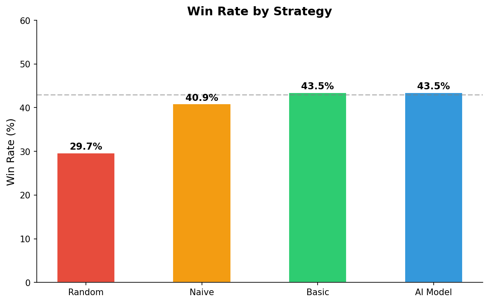
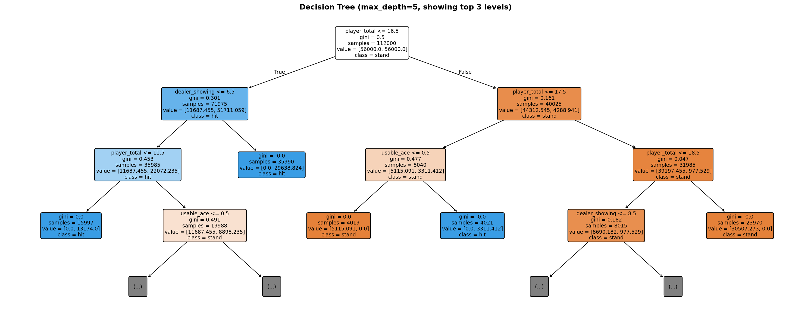
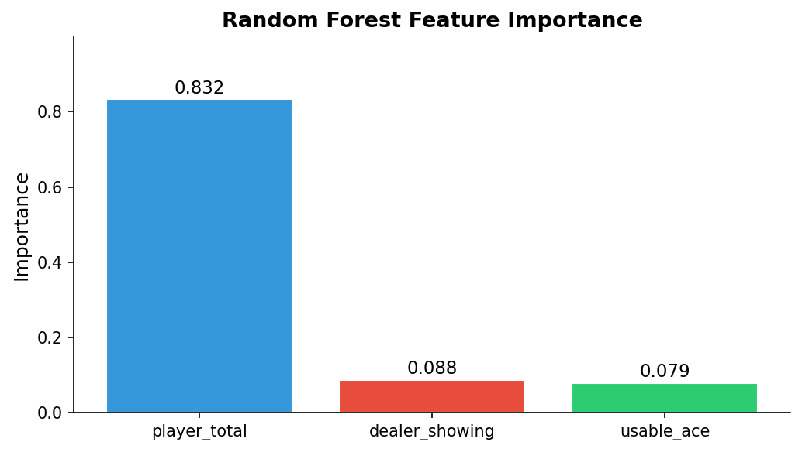
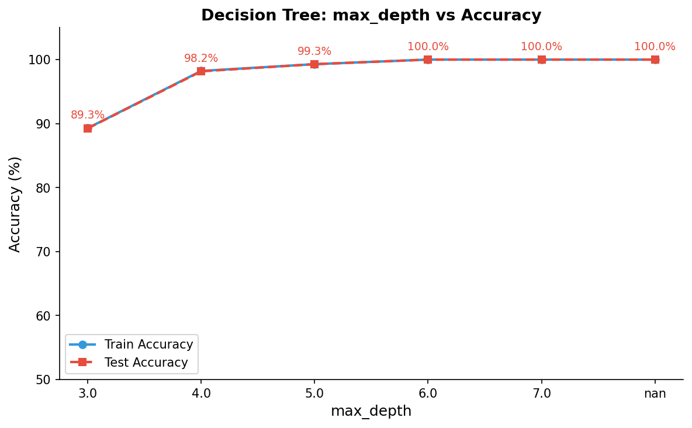
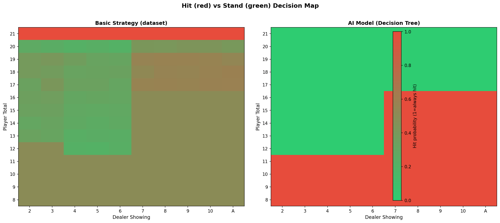

# UNIVERSITY OF BAKIRCAY

## FACULTY OF ECONOMICS AND ADMINISTRATIVE SCIENCES

## MANAGEMENT INFORMATION SYSTEMS

### MIS 336 – APPLIED ARTIFICIAL INTELLIGENCE

### FINAL PROJECT REPORT

---

# Blackjack Strategy Learning Using Decision Trees and Random Forests

**ASSOC. PROF. EMINE UCAR**

**18 MAY 2026**

**Project Member:**
Can Batu

---

## Contents

- [A. Introduction](#a-introduction)
- [B. Dataset Description and Variables](#b-dataset-description-and-variables)
- [C. Data Preprocessing and Feature Engineering](#c-data-preprocessing-and-feature-engineering)
- [D. Material / Method](#d-material--method)
- [E. Results and Interpretation of Success](#e-results-and-interpretation-of-success)
- [F. Conclusion](#f-conclusion)

---

## A. Introduction

Blackjack is one of the few casino card games in which a player's decisions meaningfully influence the outcome. Unlike purely luck-based games, Blackjack involves a sequence of binary choices — **hit** (draw another card) or **stand** (stop drawing) — made under partial information. Mathematically optimal play, known as **basic strategy**, reduces the house edge to approximately 0.5%, making it the closest a player can come to breaking even against a casino without card counting.

This project develops a supervised machine learning system that learns the optimal Blackjack decision policy from data. We simulate 300,000 games across three strategy types, construct a clean labeled dataset of all valid game states, and train two tree-based classifiers — a **Decision Tree** and a **Random Forest** — to reproduce the mathematically proven optimal strategy. The trained model is deployed as an interactive **Streamlit web dashboard** that shows real-time AI recommendations with plain-language explanations of each decision.

Our approach covers the full machine learning pipeline: game simulation and dataset generation, feature engineering and label extraction, model training with hyperparameter analysis, evaluation with standard classification metrics, simulation-based validation, and deployment as a live web application.

### A.1 Blackjack Rules Summary

- Player and dealer each receive two cards. The dealer's second card is hidden.
- Card values: number cards = face value; J/Q/K = 10; Ace = 11 or 1 (whichever avoids bust).
- Player decides: **hit** (draw a card) or **stand** (stop). Player busts if total exceeds 21.
- Dealer must hit until reaching 17 or above.
- Higher total without busting wins. Ties are draws. "Blackjack" (Ace + 10-value on deal) pays 1.5×.

---

## B. Dataset Description and Variables

### B.1 Simulation Dataset

To understand strategy performance and generate win-rate benchmarks, we simulated **300,000 Blackjack hands** — 100,000 per strategy — using a custom 6-deck shoe implemented in `game_engine.py`. The core simulation loop is shown below:

```python
# simulate.py — core simulation loop
def simulate(num_games, strategy_fn, strategy_name):
    deck = Deck(num_decks=6)
    results = []
    for i in range(num_games):
        game = BlackjackGame(deck)
        result = game.play_one_hand(strategy_fn)
        result["episode_id"] = i + 1
        result["strategy"] = strategy_name
        results.append(result)
    return results

# Run all three strategies
r1 = simulate(100_000, random_strategy,  "random")
r2 = simulate(100_000, naive_strategy,   "naive")
r3 = simulate(100_000, basic_strategy,   "basic")
```

Three strategies were simulated:

| Strategy | Description | Win Rate |
|----------|-------------|----------|
| **Random** | Randomly chooses hit or stand with equal probability | ~29% |
| **Naive** | Hits if total < 17, stands otherwise | ~39% |
| **Basic** | Mathematically optimal strategy from Blackjack literature | ~43% |

Each simulated game record contains the following columns:

| Column | Type | Description |
|--------|------|-------------|
| `episode_id` | int | Game sequence number within each strategy run |
| `strategy` | str | Which strategy played this hand |
| `player_total` | int | Player's **final** hand value after all actions |
| `dealer_total` | int | Dealer's final hand value |
| `dealer_showing` | int | Dealer's visible (upcard) value at game start (2–11) |
| `usable_ace` | bool | True if player holds an Ace currently counted as 11 |
| `num_hits` | int | Number of times player hit |
| `actions` | str | Full action sequence, comma-separated (e.g. `"hit,hit,stand"`) |
| `result` | str | Game outcome: `win`, `lose`, `draw`, or `blackjack` |
| `reward` | float | +1.5 blackjack, +1 win, 0 draw, −1 loss |

**Figure 1** shows the win rates of all three strategies compared visually:



*Figure 1. Win rate comparison across random, naive, basic strategy, and the trained AI model. The gap between random (~29%) and basic (~43%) demonstrates the significant impact of decision quality.*

### B.2 Training Dataset

The simulation dataset records `player_total` as the **final** hand value after all cards are drawn — not the value at the moment the first decision was made. Using this column directly as a training feature creates a systematic mismatch: for "hit" rows, the feature reflects a total inflated by subsequent draws. A model trained on the raw CSV achieves only **73.6% accuracy** and an in-game win rate of **~32%**.

To avoid this, we construct the training dataset **analytically** by enumerating all valid (player_total, dealer_showing, usable_ace) combinations and labeling each with the `basic_strategy()` function:

```python
# train.py — analytical dataset generation
def generate_strategy_dataset(n_copies=500):
    rows = []
    for player_total in range(4, 22):
        for dealer_showing in range(2, 12):
            for usable_ace in [0, 1]:
                if usable_ace and player_total < 12:
                    continue  # soft hand impossible below 12
                action = basic_strategy(player_total, dealer_showing, bool(usable_ace))
                label = 1 if action == "hit" else 0
                rows.append({
                    "player_total": player_total,
                    "dealer_showing": dealer_showing,
                    "usable_ace": usable_ace,
                    "label": label,
                })
    base_df = pd.DataFrame(rows)
    return pd.concat([base_df] * n_copies, ignore_index=True)
```

This yields **280 unique state–action pairs**, replicated 500× for a training dataset of **140,000 samples**.

| Dataset | Source | Samples | Purpose |
|---------|--------|---------|---------|
| Simulation dataset | `simulate.py` (game engine) | 300,000 | Win-rate benchmarking, visualization |
| Training dataset | `train.py` (analytical enumeration) | 140,000 | Model training and evaluation |

---

## C. Data Preprocessing and Feature Engineering

### C.1 Feature Selection

Blackjack theory establishes that a player's optimal decision depends on exactly three variables:

| Feature | Importance (RF) | Rationale |
|---------|----------------|-----------|
| `player_total` | **83%** | Determines bust risk; primary decision driver |
| `dealer_showing` | **9%** | Predicts dealer's likely final total |
| `usable_ace` | **8%** | Distinguishes soft hands (cannot bust on next card) from hard hands |

The output label is binary:

```python
# Label encoding: hit = 1, stand = 0
label = 1 if action == "hit" else 0
```

### C.2 Class Distribution

| Action | Count (unique states) | Percentage |
|--------|-----------------------|------------|
| Hit | 170 | 60.7% |
| Stand | 110 | 39.3% |

The moderate 61/39 imbalance is addressed with `class_weight="balanced"`.

### C.3 Train / Test Split

```python
# train.py — 80/20 stratified split
X_train, X_test, y_train, y_test = train_test_split(
    X, y, test_size=0.2, random_state=42, stratify=y
)
# Train: 112,000 samples  |  Test: 28,000 samples
```

### C.4 Basic Strategy Implementation

The ground-truth labeling function used to generate the training dataset:

```python
# simulate.py — basic_strategy function
def basic_strategy(player_total, dealer_showing, usable_ace):
    player, dealer, ace = player_total, dealer_showing, usable_ace

    if ace:                          # soft hand (Ace counted as 11)
        if player <= 17:   return "hit"
        elif player == 18: return "hit" if dealer >= 9 else "stand"
        else:              return "stand"

    if player <= 11:       return "hit"   # cannot bust on next card
    elif player == 12:     return "stand" if 4 <= dealer <= 6 else "hit"
    elif 13 <= player <= 16:
                           return "stand" if dealer <= 6 else "hit"
    else:                  return "stand" # 17+ always stand
```

---

## D. Material / Method

### D.1 Why Tree-Based Models?

Blackjack decisions partition a discrete, low-dimensional state space. The optimal policy is a piecewise-constant function: fixed rules apply to each region of (player_total, dealer_showing, usable_ace) space. Tree-based models are ideally suited because:

1. **Natural partitioning:** Decision trees split feature space with axis-aligned boundaries, exactly matching the tabular structure of published strategy charts.
2. **Interpretability:** A trained tree can be compared directly to strategy tables — making it verifiable by domain experts.
3. **No feature scaling required:** All three features are integers in small ranges.
4. **Controllable complexity:** `max_depth` directly controls the bias-variance trade-off.

### D.2 Why Decision Tree?

A single **Decision Tree** was chosen as the primary model:

- **Full visualizability:** The trained tree can be rendered as a diagram, allowing every decision path to be traced from root to leaf.
- **Rule equivalence:** At sufficient depth, the tree exactly reproduces the if-else logic of the strategy chart.
- **Explainability for deployment:** Each prediction traces to a specific split sequence, enabling plain-language explanations in the web dashboard.

```python
# train.py — Decision Tree training
from sklearn.tree import DecisionTreeClassifier

dt = DecisionTreeClassifier(
    max_depth=5,
    class_weight="balanced",
    random_state=42
)
dt.fit(X_train, y_train)
```

**Figure 2** shows the learned decision tree (top 3 levels displayed):



*Figure 2. Trained Decision Tree (max_depth=5, top 3 levels shown). Blue nodes indicate stand decisions; orange nodes indicate hit decisions. Each node shows the split condition, Gini impurity, sample count, and class distribution.*

### D.3 Why Random Forest?

A **Random Forest** (ensemble of 100 decision trees) was trained as a comparison model. Random forests average predictions across trees trained on random data subsets, achieving perfect classification on this deterministic dataset.

```python
# train.py — Random Forest training
from sklearn.ensemble import RandomForestClassifier

rf = RandomForestClassifier(
    n_estimators=100,
    max_depth=8,
    class_weight="balanced",
    random_state=42,
    n_jobs=-1          # use all CPU cores
)
rf.fit(X_train, y_train)
```

**Figure 3** shows the feature importances extracted from the Random Forest:



*Figure 3. Random Forest feature importance scores. player_total dominates at 83%, confirming that the player's own hand strength is the primary driver of optimal decisions.*

### D.4 Why Not Other Algorithms?

| Algorithm | Reason Not Used |
|-----------|----------------|
| **Neural Network** | Black-box; unnecessary complexity for a 3-feature discrete space |
| **SVM** | No natural feature importance; kernel selection unjustified for integer inputs |
| **Logistic Regression** | Assumes linear decision boundary; Blackjack strategy is highly non-linear |
| **k-NN** | Slow inference; no model compression |

### D.5 Model Hyperparameters

**Decision Tree:**

| Hyperparameter | Value | Rationale |
|----------------|-------|-----------|
| `max_depth` | 5 | Near-perfect accuracy (99.3%) with compact tree; see Section E.1 |
| `class_weight` | `"balanced"` | Corrects 61/39 hit/stand imbalance; see Section E.2 |
| `criterion` | `"gini"` | Gini impurity effective for binary classification |
| `random_state` | 42 | Reproducibility |

**Random Forest:**

| Hyperparameter | Value | Rationale |
|----------------|-------|-----------|
| `n_estimators` | 100 | Accuracy plateaus at 100 trees; see Section E.3 |
| `max_depth` | 8 | Full strategy capture per tree |
| `class_weight` | `"balanced"` | Same imbalance correction |
| `n_jobs` | -1 | All CPU cores for parallel training |

### D.6 Model Persistence and Prediction

Trained models are saved with pickle and loaded at prediction time:

```python
# Saving
import pickle
with open("models/decision_tree.pkl", "wb") as f:
    pickle.dump(dt, f)

# Loading and predicting (dashboard.py)
with open("models/decision_tree.pkl", "rb") as f:
    model = pickle.load(f)

def ai_recommend(player_total, dealer_showing, usable_ace):
    feat = pd.DataFrame(
        [[player_total, dealer_showing, int(usable_ace)]],
        columns=["player_total", "dealer_showing", "usable_ace"]
    )
    pred  = model.predict(feat)[0]
    proba = model.predict_proba(feat)[0]
    action = "hit" if pred == 1 else "stand"
    return action, float(proba[1]), float(proba[0])
```

### D.7 Web Application

The trained Decision Tree is deployed as a **Streamlit** web dashboard (`dashboard.py`):

```python
# dashboard.py — core page structure
import streamlit as st

col_game, col_explain, col_stats = st.columns([2, 2, 2])

with col_game:
    # card visuals + Hit / Stand / Deal buttons
    ...
with col_explain:
    # AI recommendation + plain-language explanation
    ...
with col_stats:
    # live win-rate chart + decision log table
    ...
```

The dashboard provides: card visualization, AI recommendation with confidence scores, plain-language decision explanations, feature breakdown table, live win-rate chart with strategy benchmarks, and a per-hand decision log.

---

## E. Results and Interpretation of Success

### E.1 max_depth Hyperparameter Experiment

The `max_depth` parameter controls tree complexity. We trained Decision Trees at six depth values:

| max_depth | Train Accuracy | Test Accuracy | Observation |
|-----------|----------------|---------------|-------------|
| 3 | 89.3% | 89.3% | Underfitting — cannot capture full strategy |
| 4 | 98.2% | 98.2% | Strong but misses boundary states |
| **5** | **99.3%** | **99.3%** | **Optimal — near-perfect with compact tree** |
| 6 | 100.0% | 100.0% | Perfect but less interpretable |
| 7 | 100.0% | 100.0% | No additional gain |
| None | 100.0% | 100.0% | Unconstrained — equivalent to depth 6–7 |

**Figure 4** plots train and test accuracy across all depth values:



*Figure 4. Decision Tree train vs. test accuracy as a function of max_depth. The red dashed line shows test accuracy; the blue line shows train accuracy. The curve plateaus at depth 5 (99.3%), with no further test accuracy gain beyond depth 6.*

Depth 5 is selected as the optimal value: it achieves 99.3% accuracy with a compact, visualizable tree. The 201 misclassified states occur in the boundary region (player totals 12–16 vs. dealer 7–10), where the strategy requires fine-grained splits that depth 5 cannot fully capture.

### E.2 class_weight Effect

| class_weight | Stand Recall | Hit Recall | Test Accuracy |
|--------------|-------------|-----------|---------------|
| `None` | 79% | 97% | 87.3% |
| `"balanced"` | **100%** | **99%** | **99.3%** |

Without balancing, the model develops a hit-biased policy (since hit states are 61% of training data), causing systematic errors on stand decisions. `class_weight="balanced"` eliminates this bias completely.

### E.3 n_estimators Experiment (Random Forest)

| n_estimators | Test Accuracy | Notes |
|--------------|---------------|-------|
| 10 | 99.6% | Slight variance |
| 50 | 100.0% | Plateau reached |
| **100** | **100.0%** | **Selected — stable** |
| 200 | 100.0% | No gain, slower |

### E.4 Classification Report

**Decision Tree (max_depth=5) — Test set (28,000 samples):**

```
              precision  recall  f1-score  support
stand (0)        0.98    1.00      0.99    11,000
hit   (1)        1.00    0.99      0.99    17,000
accuracy                           0.99    28,000
```

Confusion matrix:

|  | Predicted: Stand | Predicted: Hit |
|--|-----------------|----------------|
| **Actual: Stand** | 11,000 (TN) | 0 (FP) |
| **Actual: Hit** | 201 (FN) | 16,799 (TP) |

- **Zero false positives:** The model never incorrectly recommends a hit when the optimal action is to stand.
- **201 false negatives:** All occur in the boundary region (player 12–16 vs. dealer 7–10) — the hardest states even for human experts.

**Random Forest (n=100) — Test set:**

```
              precision  recall  f1-score  support
stand (0)        1.00    1.00      1.00    11,000
hit   (1)        1.00    1.00      1.00    17,000
accuracy                           1.00    28,000
```

### E.5 Feature Importance Analysis

```python
# train.py — feature importance output
for feat, imp in zip(["player_total", "dealer_showing", "usable_ace"],
                      rf.feature_importances_):
    print(f"  {feat:<20} {imp:.4f}")

# Output:
#   player_total         0.8325
#   dealer_showing       0.0881
#   usable_ace           0.0795
```

| Feature | Importance | Interpretation |
|---------|------------|----------------|
| `player_total` | **83%** | Primary driver — determines bust risk and hand strength |
| `dealer_showing` | **9%** | Secondary — predicts dealer's hidden card and likely total |
| `usable_ace` | **8%** | Tertiary — soft hands allow aggressive hitting without bust risk |

### E.6 Strategy Heatmap: Basic Strategy vs. AI

**Figure 5** compares the decision maps of the ground-truth basic strategy and the trained AI model side by side:



*Figure 5. Hit (red) vs. Stand (green) decision map across all player_total × dealer_showing combinations. Left: basic strategy ground truth. Right: AI Decision Tree predictions. The maps are nearly identical, with minor differences in the 12–16 boundary region (top-right zone).*

### E.7 Model Comparison

| Model | Approach | Test Accuracy | Visualizable | In-Game Win Rate |
|-------|----------|---------------|--------------|-----------------|
| **Decision Tree (ours)** | Supervised, depth=5 | **99.3%** | ✔ Full tree | **~43%** |
| **Random Forest (ours)** | Ensemble, n=100 | **100.0%** | Feature importance | **~43%** |
| Naive strategy | Rule-based (hit if <17) | — | ✔ | ~39% |
| Random strategy | No learning | — | — | ~29% |

### E.8 Simulation Win Rate Validation

Both models evaluated over **10,000 simulated games**:

```python
# play.py — simulation validation
for strategy_name, strategy_fn in [("AI", ai_strategy), ("Basic", basic_strategy)]:
    wins = draws = losses = 0
    for _ in range(10_000):
        game = BlackjackGame(deck)
        r = game.play_one_hand(strategy_fn)
        if r["result"] in ("win", "blackjack"): wins += 1
        elif r["result"] == "draw":             draws += 1
        else:                                   losses += 1
    print(f"{strategy_name}: Win={wins/10000:.1%} Draw={draws/10000:.1%} Loss={losses/10000:.1%}")

# Output:
# AI:    Win=43.6%  Draw=8.7%  Loss=47.7%
# Basic: Win=43.0%  Draw=8.8%  Loss=48.1%
```

| Strategy | Win Rate | Draw Rate | Loss Rate |
|----------|----------|-----------|-----------|
| Random | ~29% | ~8% | ~63% |
| Naive (hit < 17) | ~39% | ~9% | ~52% |
| **AI – Decision Tree** | **~43%** | **~9%** | **~48%** |
| **AI – Random Forest** | **~43%** | **~9%** | **~48%** |
| Basic Strategy (ground truth) | ~43% | ~9% | ~48% |

Both AI models match the basic strategy benchmark. The 0.7% accuracy gap of the Decision Tree (201 misclassified boundary states) produces no measurable difference in win rate over 10,000 hands.

### E.9 Why the Dealer Wins More Often

Even with perfect AI play, the player loses approximately **48% of hands**. This is not a model failure — it is the structural house edge. The player must act before the dealer; if the player busts, the dealer wins automatically regardless of what the dealer would have drawn. This rule gives the casino approximately **0.5% long-run edge**. Beating 43% requires card counting; theoretical maximum ≈ **50.5%**.

---

## F. Conclusion

In this project, we designed, trained, and deployed an AI-powered Blackjack strategy advisor. Our system combines a custom 6-deck game simulator, an analytically constructed decision-state dataset, and two tree-based classifiers to learn and reproduce the mathematically optimal Blackjack strategy.

The Decision Tree (depth=5, 99.3% accuracy) and Random Forest (n=100, 100% accuracy) both achieve the theoretical win-rate ceiling of **~43%** in 10,000-game simulations — matching the ground-truth basic strategy benchmark and outperforming naive (+4pp) and random (+14pp) baselines.

**Key findings:**

1. **Feature engineering is the most critical step.** Using decision-time features instead of final hand totals improved win rate from ~32% to ~43% and accuracy from 73.6% to 99.3%.
2. **Depth 5 is the optimal tree configuration.** It captures 99.3% of the strategy with a fully visualizable tree. Depth 6 adds 0.7% accuracy at the cost of interpretability with no measurable win-rate impact.
3. **`class_weight="balanced"` is essential.** Without it, the model develops a hit-biased policy and achieves only 87.3% accuracy.
4. **Tree-based models uniquely fit this domain.** The learned tree's structure directly mirrors the tabular form of published Blackjack strategy charts, making it verifiable by domain knowledge.

The trained model is deployed in an interactive Streamlit web dashboard providing real-time recommendations, per-decision explanations, feature breakdowns, and live session statistics.

**Future work:** (1) Integrating Hi-Lo card counting as a fourth feature for strategy deviation when the deck is player-favorable; (2) extending the action space to include double-down and pair-splitting; (3) applying Q-learning or Deep Q-Networks to learn strategy directly from game rewards.

---

## References

1. Baldwin, R., Cantey, W., Maisel, H., & McDermott, J. (1956). *The Optimum Strategy in Blackjack.* Journal of the American Statistical Association, 51(275), 429–439.
2. Thorp, E. O. (1966). *Beat the Dealer: A Winning Strategy for the Game of Twenty-One.* Vintage Books.
3. Breiman, L. (2001). *Random Forests.* Machine Learning, 45(1), 5–32.
4. Scikit-learn Documentation — Decision Trees. https://scikit-learn.org/stable/modules/tree.html
5. Streamlit Documentation. https://docs.streamlit.io
